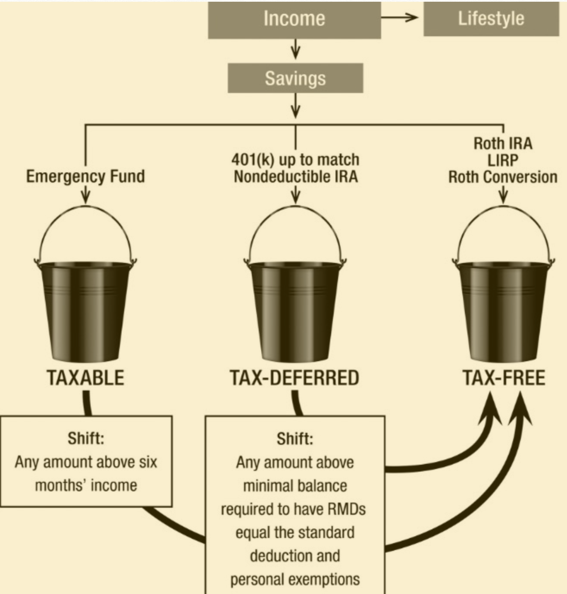

## Retirement Tax 

Taken from: [The Power of Zero](https://www.amazon.com/Power-Zero-Revised-Updated-Retirement-ebook/dp/B07C6TLPKK/ref=sr_1_1?gclid=Cj0KCQjwov3nBRDFARIsANgsdoGooEO42xLOhTJ_jIhiajO3w0KH932WTNjM7_h07yswhQ3kviq_HDMaAoU_EALw_wcB&hvadid=174247353503&hvdev=c&hvlocphy=1014221&hvnetw=g&hvpos=1t1&hvqmt=e&hvrand=6324418929106046054&hvtargid=aud-647846986281%3Akwd-12152710986&hydadcr=22536_9636733&keywords=the+power+of+zero&qid=1560302602&s=gateway&sr=8-1)

### Context

New tax code: from now to 2026 we are experiencing lowest tax rates especially for those that fall within the 22-24% tax bracket. Now is the time to pay tax and shift as much of your surplus of traditional IRAs and income towards tax free retirement accounts. *Asset shifts*

### Take Aways 

1. Keep up to 6 months of your salary/how much you need to survive in liquid form (CDs, saving accounts and so forth) expect to be taxed on the gains made and be open for risk of inflation 
2. As a rule of thumb, you should always put money into your 401( k) up to the employer match, but nothing more. (Free money from company match) 
    * The **Goal** is to not pay taxes on your 401k distribution you want at age of retirement your 401k shouldn’t have more than X so that your Required Minimal Distribution (RMD) (3.65% of total 401k) is less than your standard deduction in that tax year which is 24K in 2018. For example: RMD <= 24k, therefore 3.65% x Total 401k Value <= 24K. To calculate this use a math formula that takes into account your current contributions and future ones until retirement. Account for your expected social security benefits by adding one-half of expected Social Security to your withdrawal amount to truly calculate your potential taxable income and ensure it is <= 24k. See [Retirement Tax Program](./retirement_tax.py) for math formula.
    * A good tax-free retirement specialist armed with the appropriate software should be able to help you determine the ideal balance in this bucket today and, if necessary, identify strategies to help reposition any surplus into the tax-free bucket.
3. Tax Free Bucket: LIRP (Life Insurance Retirement Policy/Plan) 
    * The key is to buy as little life insurance as is required by the IRS while maximizing contributions.To maximize cash accumulation and minimize expense, the contract must contain as little life insurance as possible while being funded at the highest level allowed under IRS guidelines.
    * Questions to ask your financial advisor or LIRP Provider:
        * How can this best be utilized to meet your tax-free retirement, life insurance, and long-term care needs?
        * How do you structure the LIRP to maximize returns within the tax-free growth account?
        * How can I mitigate for a job loss or inability to pay for contribution to LIRP? 
    * You can grow your dollars in the LIRP account via the following mechanisms:
        * General account of the life insurance company
        * The stock market 
        * An indexed-based approach
    * Evaluate which LIRPs to use based on:
        * Management Expenses
        * Long-term care provisions: Some LIRPs provide a life insurance policy that can also be used for Long Term Care if needed
        * Cost free distributions. What costs do you have to pay to be able to withdraw/distribute your money?
        * Financial stability of LIRP company 
        * Over-loan protection rider. This protects against your LIRP value going below $1 and the IRS making you pay taxes because you had no intentions of using this as a life insurance policy
        * How soon can you take out 0% loan. The average is after 6 years of contributions.
        * What type of death benefit? 
            * Decreasing as cash value increases
            * Increasing as cash value increases 

            